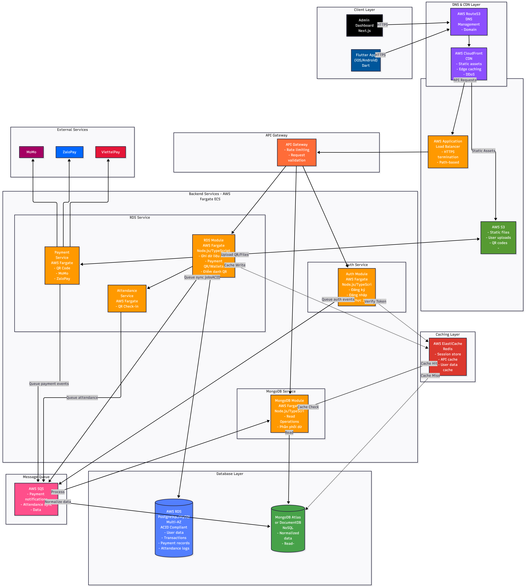

# ARCHITECTURE.md - OmniMer EDU

## 1. Tổng quan Kiến trúc (Overview)

Hệ thống được xây dựng theo kiến trúc **Microservices**, chia tách thành các module nghiệp vụ riêng biệt để tối ưu hóa khả năng mở rộng và quản lý.

### Nguyên lý hoạt động chính:

- **Microservices:** Hệ thống được chia thành 2 module chính: **User Module** và **Payment & Attendance Module**.
- **CQRS (Command Query Responsibility Segregation):** Tách biệt luồng Ghi (Write) và luồng Đọc (Read).
- **RDS (PostgreSQL) + Sequelize:** Đóng vai trò là "Source of Truth" cho luồng Ghi, đảm bảo tính toàn vẹn dữ liệu (ACID).
- **MongoDB:** Đóng vai trò là Read Model cho luồng Đọc, tối ưu tốc độ truy xuất. Dữ liệu được đồng bộ từ RDS sang MongoDB.
- **Hybrid Deployment:** Hỗ trợ linh hoạt giữa MongoDB trên VPS Ubuntu và AWS DynamoDB (hoặc DocumentDB) cho môi trường AWS.

---

## 2. Tech Stack

### Frontend

- **Mobile App (User):**
  - **Framework:** Flutter (Dart).
  - **Platform:** iOS, Android.
  - **Mục tiêu:** Giao diện chính cho người dùng cuối (Học sinh, Phụ huynh, Giáo viên).
- **Admin Web:**
  - **Framework:** Next.js (TypeScript).
  - **Mục tiêu:** Giao diện quản trị hệ thống, quản lý dữ liệu.

### Backend

- **Ngôn ngữ:** Node.js.
- **Ngôn ngữ lập trình:** TypeScript.
- **Kiến trúc:** Microservices.

### Database & Caching

- **Write Database (Transactional):** AWS RDS (PostgreSQL) - Sử dụng ORM Sequelize.
- **Read Database (Analytics/Query):** MongoDB (Deploy trên VPS Ubuntu) hoặc AWS DynamoDB (cho môi trường AWS).
- **Caching:** Redis.

### Infrastructure

- **Deployment:** AWS Fargate (Serverless Compute for Containers) hoặc VPS Ubuntu.

---

## 3. Chi tiết các Microservices

Backend được chia thành 2 module nghiệp vụ chính (bên cạnh Auth Service):

### 3.1. Auth Module Service

- **Chức năng:**
  - Đăng ký (Register).
  - Đăng nhập (Login).
  - Xác thực (Authentication & Authorization).
  - Quản lý Token (JWT/Session).

### 3.2. User Module Service

- **Phạm vi quản lý (Domain):**
  - **User:** Quản lý thông tin người dùng.
  - **School:** Quản lý thông tin trường học.
  - **Class:** Quản lý lớp học.
  - **Grade:** Quản lý khối/lớp.
  - **MembershipRequest:** Quản lý yêu cầu tham gia.
  - **ActivityLog:** Ghi nhật ký hoạt động hệ thống.
- **Công nghệ:**
  - **Write:** RDS (PostgreSQL) + Sequelize ORM.
  - **Read:** MongoDB.
- **Cơ chế CQRS:**
  - Khi có dữ liệu mới (Write) vào RDS, hệ thống sẽ tạo/cập nhật bảng (collection) tương ứng trong MongoDB.
  - Các request lấy dữ liệu (Read) sẽ truy vấn trực tiếp từ MongoDB.

### 3.3. Payment & Attendance Module Service

- **Phạm vi quản lý (Domain):**
  - **Payment:** Quản lý thanh toán.
  - **Tuition:** Quản lý học phí.
  - **Attendance:** Quản lý điểm danh.
  - **Holiday:** Quản lý ngày nghỉ lễ.
- **Công nghệ:**
  - **Write:** RDS (PostgreSQL) + Sequelize ORM.
  - **Read:** MongoDB.
- **Cơ chế CQRS:**
  - Tương tự User Module, dữ liệu ghi vào RDS sẽ được đồng bộ sang MongoDB.
  - Request đọc dữ liệu (ví dụ: lịch sử thanh toán, bảng điểm danh) sẽ lấy từ MongoDB.

---

## 4. Luồng dữ liệu (Data Flow)

### Luồng Ghi (Write Flow)

`Client` -> `User/Payment Module` -> `Sequelize ORM` -> `RDS (PostgreSQL)` -> _(Sync Event)_ -> `MongoDB/DynamoDB`

### Luồng Đọc (Read Flow)

`Client` -> `User/Payment Module` -> `MongoDB/DynamoDB` -> `Client`

_Lưu ý: Việc đọc dữ liệu được thực hiện từ MongoDB để đảm bảo tốc độ cao._

---

## 5. Deployment Model

Hệ thống hỗ trợ 2 mô hình triển khai cơ sở dữ liệu NoSQL (Read DB):

1.  **Môi trường VPS (Ubuntu):**
    - Sử dụng **MongoDB** self-hosted.
2.  **Môi trường AWS:**
    - Sử dụng **AWS DynamoDB** (hoặc Amazon DocumentDB tương thích MongoDB).
    - Cấu hình ứng dụng cho phép chuyển đổi driver/adapter tùy thuộc vào biến môi trường.

---

## 6. Chi tiết Luồng Hạ tầng AWS (AWS Infrastructure Flow)

### 1. Entry Point

- **ALB (Application Load Balancer):** Điều hướng request đến đúng Service (User Module hoặc Payment Module).

### 2. Compute Layer

- **User Module Service:** Xử lý logic User, School, Class...
- **Payment & Attendance Service:** Xử lý logic Payment, Attendance...

### 3. Data Layer

- **AWS RDS (PostgreSQL):** Lưu trữ dữ liệu chính (Write).
- **NoSQL Store:** MongoDB (trên EC2/VPS) hoặc DynamoDB (Managed) cho dữ liệu đọc.
- **Redis:** Caching.
